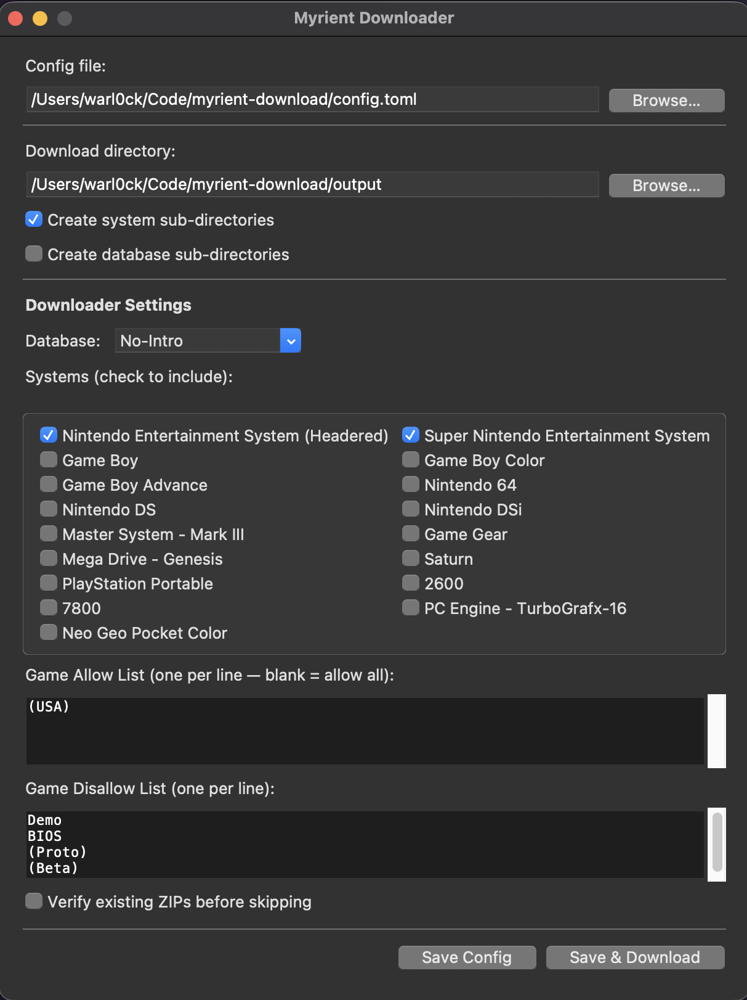

# Myrient ROM Downloader

[](https://github.com/TuckerWarlock/myrient-download/actions/workflows/tests.yml)

Download ROM zip files from [Myrient](https://myrient.erista.me) via HTTPS with filtering, concurrent downloads, and a GUI config editor.

Originally adapted from [myrient-rsync](https://github.com/secretx51/myrient-rsync). Further improvements synced from [kism/myrient-download](https://github.com/kism/myrient-download).



## Requirements

- Python 3.14+
- [uv](https://docs.astral.sh/uv/) (package manager)

## Installation

```bash
# Install as a tool (recommended)
uv tool install git+https://github.com/TuckerWarlock/myrient-download

# Or clone and run locally
git clone https://github.com/TuckerWarlock/myrient-download
cd myrient-download
uv sync
```

## Usage

### GUI (recommended for first-time setup)

```bash
uv run myrient-download --gui --config config.toml
```

Opens a desktop window where you can:
- Pick your download directory
- Select systems from a grouped checklist (No-Intro / Redump)
- Set game allow/disallow filters
- Toggle options like ZIP verification and directory structure
- Save the config and launch a download — all without touching a file

### CLI

```bash
uv run myrient-download --config config.toml
```

```
options:
  --config PATH       Path to config file (default: config.toml)
  --directory PATH    Override the download directory
  --log-level LEVEL   Logging verbosity: TRACE, DEBUG, INFO, WARNING, ERROR (default: INFO)
  --gui               Launch the graphical config editor
```

## Configuration

Config is stored as a TOML file. Run with `--gui` to generate one interactively, or create it manually:

```toml
download_dir = "/home/user/roms"
create_and_use_system_directories = true
create_and_use_database_directories = false

[[myrient_downloader]]
myrient_url = "https://myrient.erista.me/files"
myrient_path = "No-Intro"          # or "Redump"
verify_existing_zips = false

systems = [
    "Nintendo - Nintendo Entertainment System (Headered)",
    "Nintendo - Super Nintendo Entertainment System",
]

game_allow_list  = ["(USA)"]
game_disallow_list = ["Demo", "BIOS", "(Proto)", "(Beta)", "(Program)"]
```

### Options

| Key | Default | Description |
|---|---|---|
| `download_dir` | `./output` | Where files are saved |
| `create_and_use_system_directories` | `true` | Organise into per-system folders |
| `create_and_use_database_directories` | `false` | Add a No-Intro / Redump parent folder |
| `myrient_path` | `No-Intro` | Database to download from |
| `systems` | NES + SNES | List of system names (must match Myrient exactly) |
| `game_allow_list` | `["(USA)"]` | Only download files containing any of these strings |
| `game_disallow_list` | `["Demo", …]` | Skip files containing any of these strings |
| `verify_existing_zips` | `false` | Re-verify already-downloaded ZIPs before skipping |

## Output Structure

```
roms/
├── Nintendo - Nintendo Entertainment System (Headered)/
│   ├── Contra (USA).zip
│   └── Mega Man 2 (USA).zip
└── Nintendo - Super Nintendo Entertainment System/
    ├── Chrono Trigger (USA).zip
    └── Super Metroid (USA, Europe).zip
```

## Features

- **Async downloads** — 3 concurrent workers for faster throughput
- **Safe writes** — files download to `.part` then rename on success; leftover partials are cleaned up on start
- **Retry logic** — up to 3 attempts per file on connection errors
- **ZIP verification** — optional integrity check with automatic removal of corrupt files
- **Coloured logging** — clear terminal output with custom TRACE level and rotating file logs
- **Config auto-backup** — if validation changes your config, the original is saved as `.bak`

## Development

```bash
uv sync                          # install all deps including dev groups
uv run pytest -q                 # run tests
uv run flake8 myrient_download/ tests/
uv run mypy myrient_download/
./scripts/run_ci_local.sh        # run everything in one shot
```

GUI tests require a display and are excluded from the default run:

```bash
uv run pytest tests/test_gui.py -v
```
